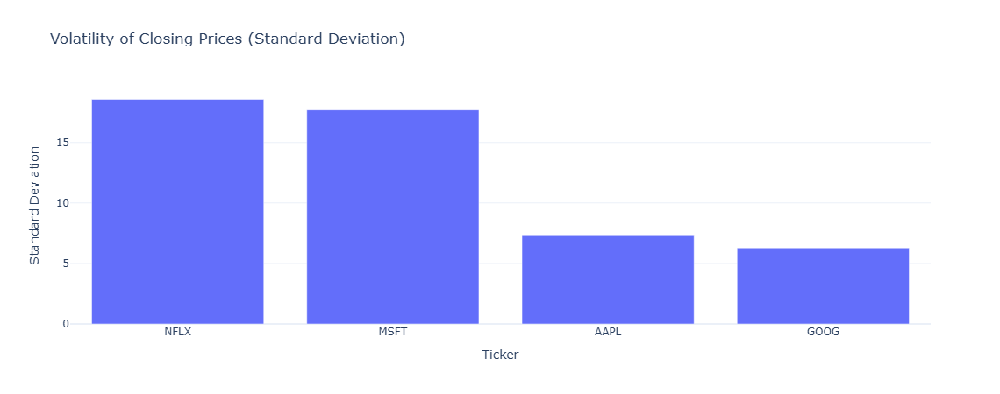
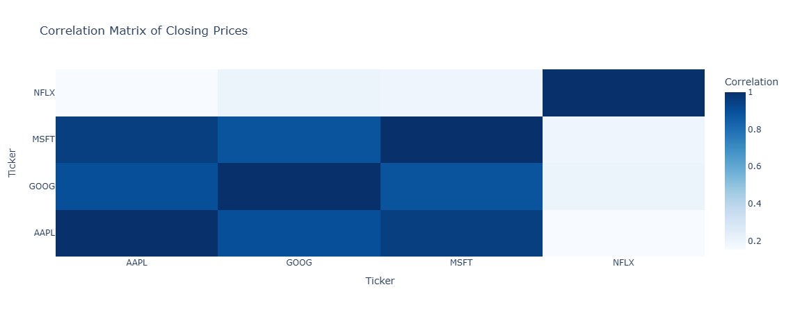
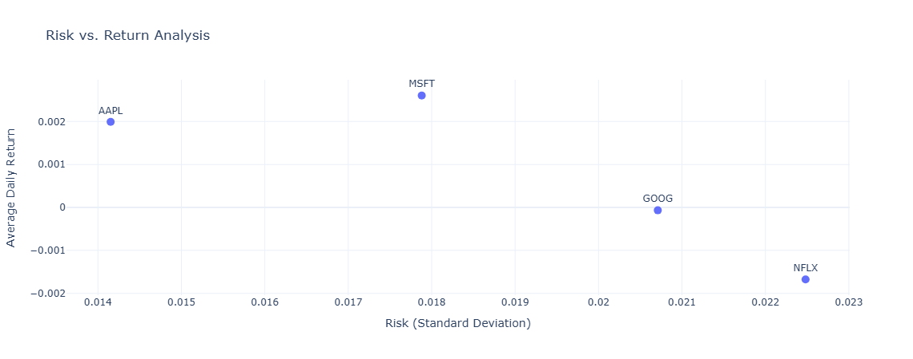
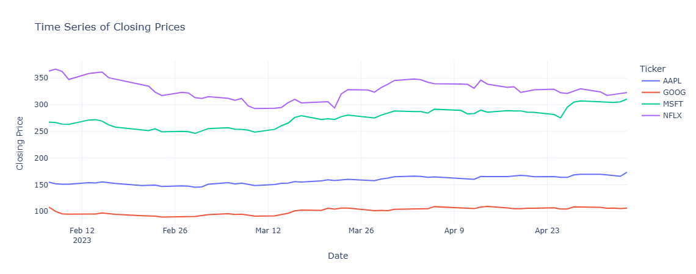

# Quantitative-Analysis-of-Stock-Market

This project implements a **quantitative analysis of the stock market using Python**, inspired by [Aman Kharwal's tutorial]
 It uses historical stock price data to generate insights through statistical calculations and visualizations.

## 📁 Project Structure

QUANTITATIVE-ANALYSIS-OF-STOCK-MARKET/
├── README.md # Project documentation
├── stock_market.ipynb # notebook for full analysis
├── stocks.csv # CSV file with list of stock tickers
└── images # Output plots and visualizations

## Analysis

The notebook performs the following steps:

1.  **Load the Dataset:** Reads the stock data from `stocks.csv`.
2.  **Descriptive Statistics:** Calculates and prints summary statistics (mean, std, min, max, quartiles) for the 'Close' price of each stock.
3.  **Time Series Analysis:** Converts the 'Date' column to datetime objects and plots the closing prices of each stock over time using Plotly.
4.  **Volatility Analysis:** Calculates the standard deviation of the closing prices for each stock and visualizes the volatility using a bar chart.
5.  **Correlation Analysis:** Computes and visualizes the correlation matrix of the closing prices using a heatmap.
6.  **Daily Risk vs. Return Analysis:** Calculates the average daily return and the standard deviation of daily returns (risk) for each stock. These are then plotted on a scatter plot to visualize the risk-return profile.

# 📊 Sample Output

### Closing Prices of Selected Stocks

### Correlation Heatmap

### Risk vs Return Plot

### Time Series plot

## Results

The analysis provides insights into:

- The statistical distribution of closing prices for each stock.
- The trends and patterns in closing prices over time.
- The relative volatility of each stock.
- The correlation between the closing prices of different stocks.
- The risk-return trade-off for each stock based on historical data.

This quantitative approach helps in understanding the historical performance and characteristics of these stocks.